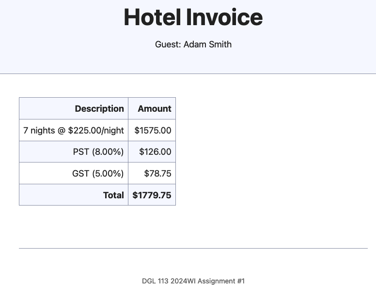

[](https://classroom.github.com/open-in-codespaces?assignment_repo_id=13309512)
# DGL 113 2024WI Assignment #1

Create a new file in the `docs` folder called `app.js`.

At the top of the `docs/app.js` file, add the `use strict` directive:

```javascript
'use strict';
```

Add a `<script>` element to the `index.html` file to include the `app.js` script.
Place the `<script>` element just before the closing `</body>` tag just like
the script element that is used to include the `main.js` script.

In the `docs/app.js` file, declare and and initialize the following variables:

- `guestName` containing the name of the guest; use the `prompt(...)` function like
  in the demonstration to ask the user to enter the guest name.
- `guestMessage` containing the subheading for the page, like `Guest: Adam Smith`;
  this will be a string expression using `guestName`
- `numberOfNights` containing the number of nights of the hotel stay; use the
  `parseInt(prompt(...))` functions like in the demonstration to ask the user to enter
  the number of nights for their stay and to convert their response to an integer
- `nightlyRate` containing the nightly rate for the hotel room (e.g. $225)
- `pstRate` containing the rate of the provincial sales tax (e.g. 8%)
- `gstRate` containing the rate of the goods and services tax (e.g. 5%)
- `subTotal` containg the cost of the hotel room for the entire stay before taxes;
  this will be an arithmetic expression based on `numberOfNights` and `nightlyRate`
- `pstAmount` containg the dollar amount for the provincial sales tax for this
  hotel stay; this will be an arithmetic expression based on `pstRate` and `subTotal`
- `gstAmount` containg the dollar amount for the goods and services tax for this
  hotel stay; this will be an arithmetic expression based on `gstRate` and `subTotal`
- `total` containg the total cost of the hotel room for the entire stay including taxes;
  this is will be an arithmetic expression based on `subTotal`, `pstAmount`, and `gstAmount`

Be sure to try different values for `numberOfNights`, `nightlyRate`, `pstRate`, and `gstRate`
to confirm that all the arithmetic expressions are calculating everything correctly.

Before final stage, commit, and push, be sure to set the variables as follows:

- `nightlyRate` to $225
- `pstRate` to 8%
- `gstRate` to 5%

NOTE: Only modify the `docs/app.js` and `docs/index.html` files. Do not make changes to any other files.

The final result will look like the image below.


